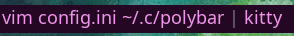

## motivation
default `xwindow` module for polybar outputs full title of application which can be long and miss the name of the application (such as occurs with kitty)

solution: use other properties such as window_class or window_instance

**comparison: title | class**




`class` will just print the application name

`name` will print the whole title
example:

class: Code

name: readme.md - i3-scripts - Visual Studio Code

## requirements
- python
- [i3ipc](https://pypi.org/project/i3ipc/)

## installation
```bash
git clone https://github.com/imaspacecat/better-xwindow-i3.git
cp better-xwindow-i3/focused-window-name.py ~/.config/polybar/scripts/focused-window-name.py
```

## how to use
```
usage: focused-window-name.py [-h] [-o OUTPUT_LENGTH] {class,instance,name,title}

Returns the title or app name of the currently focused window

positional arguments:
  {class,instance,name,title}
                        print class of focused window

options:
  -h, --help            show this help message and exit
  -o OUTPUT_LENGTH, --output_length OUTPUT_LENGTH
                        max number of characters to print for title
```


put the following in your polybar `config.ini` with the given cli argument (example below uses `class`)
```ini
[module/window-name]
type = custom/script
label = %output%
label-foreground = ${colors.primary}
exec = python ~/.config/polybar/scripts/focused-window-name.py class
tail = true
```

and then 
```ini
[bar/main]
...
modules-center = window-name
...
```